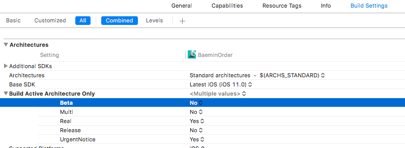

# 2017-11-21 TIL 
## AWS SQS - EC2 연결시 IAM 설정이 필요하다. 
- 상황 : 단말기 서버를 agentLIV를 통해 라이브 정보 업데이트를 하려던 상황 
    + 1개 서버만 배포했었음
    + 베타에서는 잘 되었던 상황 
        *  베타는 권한 설정이 달라서 괜찮았었던 것 같음 
        *  aws-elasticbeanstalk-ec2-role IAM이 걸려있었어야 함 
- 대처 : 바로 마스터 브랜치로 재배포 
- Error Message : Could not load credentials from any providers

### log 
```
21 Nov 2017 07:01:11.114<14>1 2017-11-20T22:01:10.970933Z maj(tmn-01) BMTMN-GWS - - - {"h":"TMN-maj","f":"SEND_SQS_LIVE","t":"2017-11-21 07:01:10:857","c":"ERR","m":{"message":"Missing credentials in config","retryable":false,"time":"2017-11-20T22:01:10.853Z","code":"CredentialsError","originalError":{"message":"Could not load credentials from any providers","retryable":false,"time":"2017-11-20T22:01:10.853Z","code":"CredentialsError"}}}bmord_error
```

## Iphone 5 armv7s 아키텍쳐에서 다운이 안되는 현상 
- 상황 : 주접앱 베타 배포된 버젼에서 armv7s를 지원 안함 
- 해결법 : Build Settings -> Build Active Architecture Only 에서 Beta yes로 변경 


